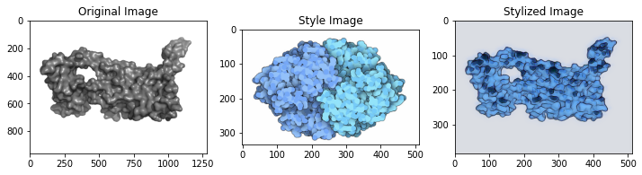
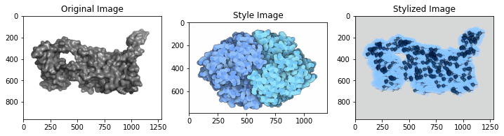

# Artistic Protein Surface Visualisation

## Installation

Execute from the directory you want the repo to be installed:

```
git clone https://github.com/aniton/Artistic-Protein-Surface-Visualisation.git
cd Artistic-Protein-Surface-Visualisation
pip install -e .
```


## Data generation

```
python ./data_generation/generate_surface.py --resolution 1
```
## 2D Models

### CNN Style Transfer

Run the following script to train the model on the generated dataset and test:

```
!python ./2d/train.py \
  --style ./style.png \
  --test ./4l6r.png \
  --test-dir ./test_res \
  --content-weight 1.5e1 \
  --checkpoint-iterations 3000 \
  --style ./style.png \
  --batch-size 20 \
  --epochs 101
  ``` 
 Add  `--shift 1` in order to calculate Gram matrices with shifted activations as suggested in [(Novak and Nikulin 2016)](https://arxiv.org/pdf/1605.04603.pdf)
 
 ## Results
 ### CNN Style Transfer
 <br>
With shifted activations when computing Gram matrices: <br>

(./results/result3d.gif)(./results/result3d.gif)(./results/result3d.gif)
