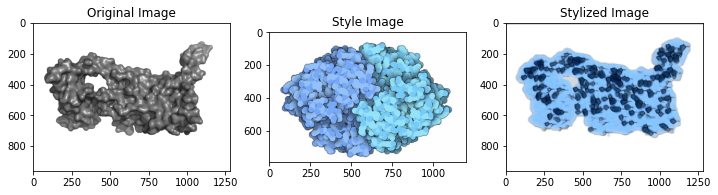
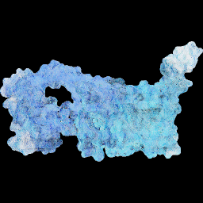

# Artistic Protein Surface Visualisation
## Aim
Transfer style of [Goodsell Art](https://ccsb.scripps.edu/goodsell/) to protein surface representations
## Installation

Execute from the directory you want the repo to be installed:

```
git clone https://github.com/aniton/Artistic-Protein-Surface-Visualisation.git
cd Artistic-Protein-Surface-Visualisation
pip install -e .
```
## Data generation
Execute in order to generate protein surfaces in .png:
```
python ./data_generation/generate_surface.py --resolution 1
```
## 2D Models

### CNN Style Transfer 
Original Paper: [(Gatys et al. 2016)](https://openaccess.thecvf.com/content_cvpr_2016/papers/Gatys_Image_Style_Transfer_CVPR_2016_paper.pdf) <br>
The training is optimized by using:
- Perceptual loss with vgg19 pretrained model [[Paper]](https://arxiv.org/pdf/1603.08155.pdf)
- Instance normalization [[Paper]](https://arxiv.org/pdf/1607.08022.pdf) <br>

Trained on protein surfaces data, generated above and fixed style image. <br>
Based on [[Implementation]](https://github.com/lengstrom/fast-style-transfer) <br>
Run the following script to train the model on the generated dataset and test:

```
python ./2d_cnn/train.py \
  --train-path ./data_generation/train_pdb \
  --style ./example/style.png \
  --test ./example/4l6r.png \
  --test-dir ./test_res \
  --content-weight 1.5e1 \
  --checkpoint-iterations 3000 \
  --batch-size 24 \
  --epochs 101
  ``` 
 Add  `--shift 1` in order to calculate Gram matrices with shifted activations as suggested in [(Novak and Nikulin 2016)](https://arxiv.org/pdf/1605.04603.pdf) to elimanate sparsity and fasten convergence.
 
### AdaIN (Adaptive Instance Normalization) for arbitrary style images
Train the model with generated proteins data and style images (put into 'goodsell_art' folder):
```
!python ./2d_adain/train_AdaIN.py --content_path ./data_generation/train_pdb --content_path --style_path ./goodsell_art
 ``` 
 One can also test our [pretrained model](https://drive.google.com/file/d/1m6n_rV0RBduJCUiG_nXzkLQUkmtnxd8k/view?usp=sharing) with arbitrary style images:
 ```
!python ./2d_adain/test_AdaIN.py --content_path ./proteins_test --content_path --style_path ./goodsell_art_test --weights weights.npy
 ``` 
 
Based on [[Paper]](https://arxiv.org/pdf/1703.06868.pdf), [[Implementation]](https://github.com/JunbinWang/Tensorflow-Style-Transfer-with-Adain).

### CycleGAN
Put the generated protein data to  ./2d_cyclegan/datasets/trainA <br>
It is suggested to train the model with a fixed style image in order to achieve considerable result. One such image was put into ./2d_cyclegan/datasets/trainB with initial installation of the repo. <br>
Train your model with
```
python ./2d_cyclegan/train_gan.py --dataroot ./2d_cyclegan/datasets/ --name pdb2good --model cycle_gan --batch_size 4 --n_epochs 35
 ``` 
One can also save our [pretrained pdb2good model](https://drive.google.com/file/d/1jcHCqAkI5xWj4GfYgkqKnUBXGh9nbHHZ/view?usp=sharing) to ./2d_cyclegan/checkpoints/pdb2good/ <br> Then it can be tested on the proteins, which in advance should be put to ./2d_cyclegan/datasets/testA:
```
python test_gan.py --dataroot ./2d_cyclegan/datasets/testA --name pdb2goodmore --model test --no_dropout --model_suffix _A 
 ``` 
 Based on [[Paper]](https://arxiv.org/pdf/1703.10593.pdf), [[Implementation]](https://github.com/junyanz/pytorch-CycleGAN-and-pix2pix)
 ## 3D Model
 ### Neural 3D Mesh Renderer
 Generate a gif and a stylized image from an .obj file and style image with a set number of optimizing steps:
 ```
 python ./3d/generate_gif.py  -io ./example/1EGQ.obj -ir ./example/style_small.jpg -is 200
 ```
 Based on [[Paper]](https://arxiv.org/abs/1711.07566), [[Implementation]](https://github.com/hiroharu-kato/neural_renderer)
 ## Results
 ### CNN Style Transfer
 <br>
With shifted activations when computing Gram matrices: <br>
 
 ### AdaIN
  <br>
   
 ### CycleGAN
  <br>

### Neural 3D Mesh Renderer

 ### Neural 3D Mesh Renderer + Reconstruction
 <br>
 ## Conclusions
 - Despite the fact that CycleGAN seems to show the best 2d result perceptually, it's not end-to-end solution, since such result can be achieved only by
     - similarity of the geometric shape of the style and content images
     - same background
     - fixed style image
     - using lsgan loss
     - batch size >= 4 
- AdaIN approach adapts well to the color of the arbitrary style image, but not to the texture.  
